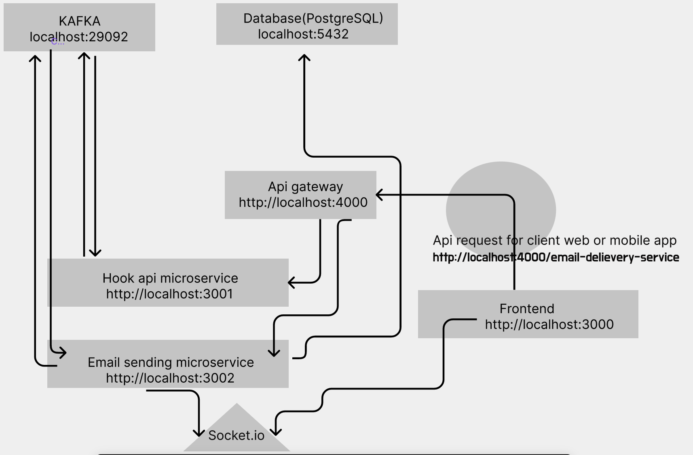

###  Email notification service
#### Application Demo : 
###### How to run the application [ `[Watch]`](https://drive.google.com/file/d/1vmSnmVfunxTmn5WXlZX_b_P93Bqcfu3T/view?usp=sharing)
###### How to test the application [`[Watch]`](https://drive.google.com/file/d/19RGgTRp2hBcs_l_RmRB4Xot_FSaoiL88/view?usp=sharing)


#### System design and architecture: 


**Clone :  `git clone https://github.com/asadpstu/email-microservice.git`**


```
$ cd email-microservice
$ mv .env.example .env
$ docker compose up
```

This command will create independent Kafka environment with kafka UI and Pgresql Database container. These resources have been used in our backend microservices.

>node version > 19 (Recommended)

## `Backend Microservice`
#### `Api gateway`: 

```
$ cd api-gateway
$ npm install
$ npm start
```

#### `Hook api microservice`: 
```
$ cd service-email-payload
$ mv .env.example .env
$ npm install
$ npm start
```

#### `Email delievery and notification microservice`: 
```
$ cd service-email-socket
$ mv .env.example .env
$ npm install
```
#### `Run Migration`
```
$ npx prisma init
$ npx prisma migrate dev --name initial db setup
```

#### `Run Test`
```
$ npm run test
```
#### `Start service`
```
$ npm start
```

#### `Run Frontend`
```
$ cd pickles-frontend
$ npm install
$ npm run dev
```

##### Open browser   `http://localhost:3000`


##### `Open Postman application` 

Payload: 
```
URL: localhost:4000/email-payload-service
Request-type: POST
{
    "subject" : "Test email microservice",
    "body" : "This is a test email for tesing purpose.",
    "receiver" : "hm.ashad.zaman@gmail.com"
}
```

#### `Compromise and Shortcut`
>I didn't use Redux because due to socket activity.

>Router hasn't been used, due to application having only 2 endpoints.


